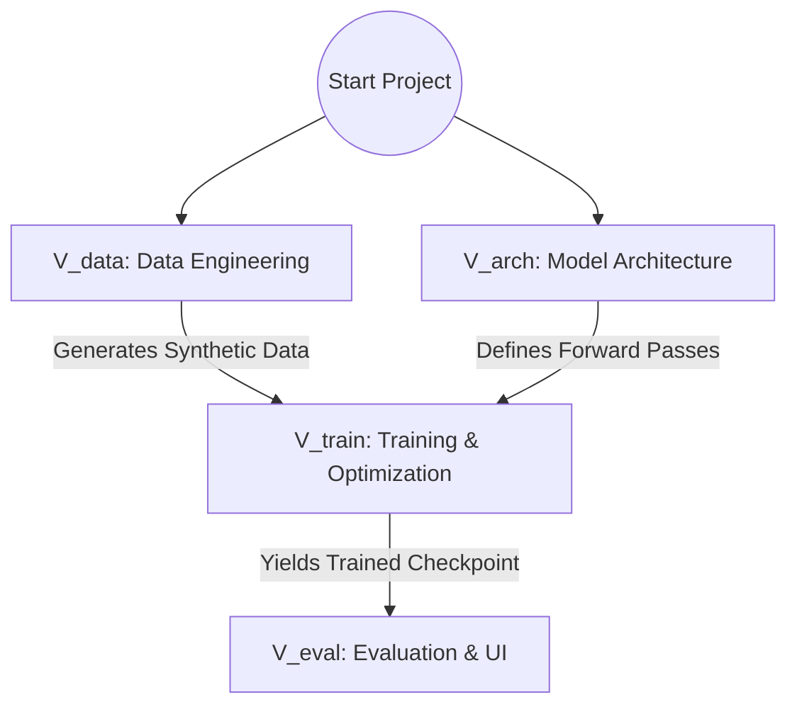

# ScanTex: Document-to-LaTeX Pipeline

## 1. Project Structure & Milestones
The project is organized into distinct milestones. `Data Engineering` and `Model Architecture` will be developed concurrently.

---

## 2. System Modules & Conceptual Data Flow

Our pipeline consists of four distinct modules.

1. **Data Pipeline (Synthetic Rendering & Augmentation)**
   * **Input:** Raw strings of LaTeX.
   * **Process:** Compiles LaTeX to PDFs, rasterizes to images, and applies spatial augmentations (rotations, elastic distortions).
   * **Output:** `Raw PDF Image` (Tensor Shape: `Batch x Channels x Height x Width`).

2. **Vision Encoder (CNN / ResNet Feature Extractor)**
   * **Input:** `Raw PDF Image`.
   * **Process:** A Convolutional Neural Network (e.g., ResNet) processes the 2D grid and extracts deep visual features. The spatial map is then flattened into a 1D sequence.
   * **Output:** `Spatial Image Features` (Tensor Shape: `Batch x Sequence x Feature_Dim`).

3. **Text Decoder (Transformer with Attention)**
   * **Input:** `Spatial Image Features`.
   * **Process:** A Transformer Decoder applies Cross-Attention to the image features and Self-Attention to previously generated tokens.
   * **Output:** `Token IDs` (Raw vocabulary indices over time).

4. **Output Rendering (Beam Search & UI)**
   * **Input:** `Token IDs`.
   * **Process:** Employs Beam Search decoding to find the most probable sequence, detokenizes the indices back into text, and displays it via a Streamlit UI.
   * **Output:** Final `LaTeX String`.

### The Pipeline Summary:
`Raw PDF Image` $\rightarrow$ **Vision Encoder** $\rightarrow$ `Spatial Image Features` $\rightarrow$ **Text Decoder** $\rightarrow$ `Token IDs` $\rightarrow$ **Output Rendering** $\rightarrow$ `LaTeX String`.
